## Using RainMon

Once the [setup steps](setup.html) are done and a data source is set up, here is a quick guide to how to perform a full analysis.

### Running the Analysis

First, select a data source:

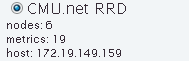

then, select the machines/nodes to analyze. The defaults for this area are taken from the data source setup.

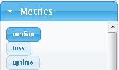

then, select some metrics to analyze. If operating in streaming mode, having proper normalization for the data source is important.

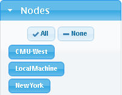

then, select the time range the analysis should be run over. Clicking the "..." buttons will bring up a date selection dialog. To use downsampling from the RRD backend, specify a ''step'' (in seconds) that will be the interval between sampled time ticks.

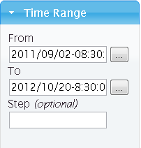

Finally, to run the analysis, choose a name for saving the analysis and click "Run analysis." A status indicator should appear, and when done the name will appear in the list of saved analyses.

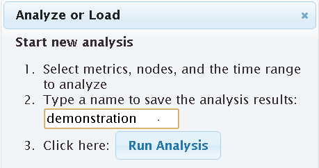

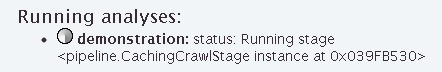

### Viewing the Results

When an analysis result is selected from the list, it will be loaded and the first hidden variable (trend) as a function of time will appear at the top of the screen.

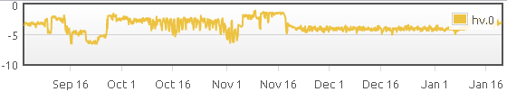

To drill down into the behavior of individual nodes, the scatterplot shows which streams are behaving similary by plotting each stream as a single point in two dimensions. Points are color-coded by which metric they are. Hover over a point to see the name of the node. Here are two examples, the left from the CMU.net dataset and the right from the Hadoop dataset:

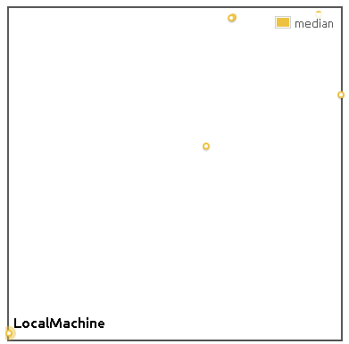

To look at an individual stream, start typing in the "Plots" box, and available stream names from the analysis will appear.

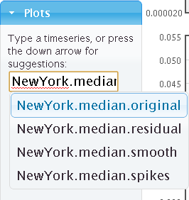

Click "Add plot" to add it to the display. To zoom into any plot in the time dimension, drag a time range to explore:

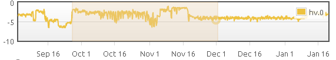

To reorder plots, drag the entire plot around, or drag it to the trash bin.

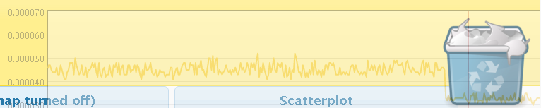